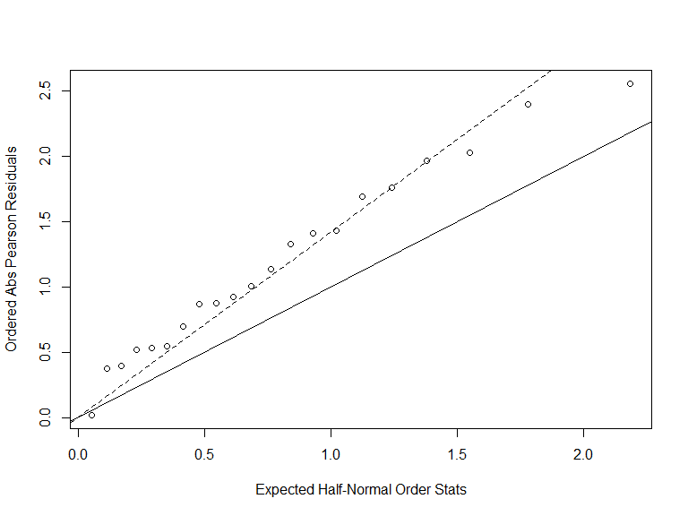

p8131\_hw3\_jsg2145
================
Jared Garfinkel
2/17/2020

## Problem 1

``` r
case_df = tibble(
  age = seq(from = 25, to = 75, by = 10),
  unexposed = c(0, 5, 21, 34, 36, 8),
  exposed = c(1, 4, 25, 42, 19, 5)
) %>% 
  mutate(case = 1)

control_df = tibble(
  age = seq(from = 25, to = 75, by = 10),
  unexposed = c(106, 164, 138, 139, 88, 31),
  exposed = c(9, 26, 29, 27, 18, 0)
) %>% 
  mutate(case = 0)

df = union(case_df, control_df) %>% 
  pivot_longer(cols = c(exposed, unexposed), names_to = "status") %>% 
  mutate(status = recode(status,
                         exposed = 1,
                         unexposed = 0))
```

``` r
fit = glm(cbind(value*(case == 1), value*(case == 0)) ~ status + age, family = binomial(link = 'logit'), data = df)

summary(fit)
```

    ## 
    ## Call:
    ## glm(formula = cbind(value * (case == 1), value * (case == 0)) ~ 
    ##     status + age, family = binomial(link = "logit"), data = df)
    ## 
    ## Deviance Residuals: 
    ##    Min      1Q  Median      3Q     Max  
    ## -7.359  -5.265   0.000   4.223  11.108  
    ## 
    ## Coefficients:
    ##             Estimate Std. Error z value Pr(>|z|)    
    ## (Intercept) -5.02345    0.41821 -12.012   <2e-16 ***
    ## status       1.78000    0.18708   9.514   <2e-16 ***
    ## age          0.06158    0.00729   8.446   <2e-16 ***
    ## ---
    ## Signif. codes:  0 '***' 0.001 '**' 0.01 '*' 0.05 '.' 0.1 ' ' 1
    ## 
    ## (Dispersion parameter for binomial family taken to be 1)
    ## 
    ##     Null deviance: 989.49  on 21  degrees of freedom
    ## Residual deviance: 809.81  on 19  degrees of freedom
    ## AIC: 815.81
    ## 
    ## Number of Fisher Scoring iterations: 4

``` r
fit = fit %>% 
  broom::tidy()
```

The difference in log odds of developing cancer is 1.78 for those with
the exposure (\>80 grams of alcohol per day) compared to those without,
holding age constant.

The log odds ratio of developing cancer is 0.06 for each 1 unit increase
in age, holding exposure constant.

## Problem 2

``` r
bean_75 = tibble(
  y = c(10, 23, 23, 26, 17),
  m = c(39, 62, 81, 51, 39)) %>% 
  mutate(extract = "bean",
         seed = "75")

cuc_75 = tibble(
  y = c(5, 53, 55, 32, 46, 10),
  m = c(6, 74, 72, 51, 79, 13)) %>% 
  mutate(extract = "cuc",
         seed = "75")

bean_73 = tibble(
  y = c(8, 10, 8, 23, 0),
  m = c(16, 30, 28, 45, 4)) %>% 
  mutate(extract = "bean",
         seed = "73")

cuc_73 = tibble(
  y = c(3, 22, 15, 32, 3),
  m = c(12, 41, 30, 51, 7)) %>% 
  mutate(extract = "cuc",
         seed = "73")

df_o = union_all(bean_75, cuc_75) %>% 
  union_all(bean_73) %>% 
  union_all(cuc_73) %>% 
  mutate(y_m = m - y,
         extract = recode(extract,
                          "bean" = 0,
                          "cuc" = 1),
         seed = recode(seed,
                       "75" = 0,
                       "73" = 1))

fit_o = glm(cbind(y, y_m) ~ seed + extract, family = binomial(link = 'logit'), df_o)

summary(fit_o)
```

    ## 
    ## Call:
    ## glm(formula = cbind(y, y_m) ~ seed + extract, family = binomial(link = "logit"), 
    ##     data = df_o)
    ## 
    ## Deviance Residuals: 
    ##     Min       1Q   Median       3Q      Max  
    ## -2.3919  -0.9949  -0.3744   0.9831   2.4766  
    ## 
    ## Coefficients:
    ##             Estimate Std. Error z value Pr(>|z|)    
    ## (Intercept)  -0.4300     0.1137  -3.781 0.000156 ***
    ## seed         -0.2705     0.1547  -1.748 0.080435 .  
    ## extract       1.0647     0.1442   7.383 1.55e-13 ***
    ## ---
    ## Signif. codes:  0 '***' 0.001 '**' 0.01 '*' 0.05 '.' 0.1 ' ' 1
    ## 
    ## (Dispersion parameter for binomial family taken to be 1)
    ## 
    ##     Null deviance: 98.719  on 20  degrees of freedom
    ## Residual deviance: 39.686  on 18  degrees of freedom
    ## AIC: 122.28
    ## 
    ## Number of Fisher Scoring iterations: 4

The log odds ratio for germination is reduced by -0.27 for species
Orobanche aegyptiaca 73 compared to Orobanche aegyptiaca 75, holding the
extract media type constant.

The log odds ratio for germination is increased by 1.06 for cucumber
extract media compared to bean extract media, holding the species
constant.

There is a log odds of -0.43 for plants that are species Orobanche
aegyptiaca 75 grown in bean extract media.

``` r
# Evaluate dispersion with Pearson Chi-Squared Residual

dev_o = deviance(fit_o)

pval_x2 = 1 - pchisq(dev_o, 19)
pval_x2
```

    ## [1] 0.003597422

A low p-value (\<0.05) indicates that there is over dispersion

``` r
# Estimate phi with the G statistic

G.stat = sum(residuals(fit_o, type = "pearson")^2)
G.stat
```

    ## [1] 38.31062

``` r
phi = G.stat/(21 - 2)
phi
```

    ## [1] 2.016348

``` r
# Estimate phi with the deviance

dev_o/(21 - 2)
```

    ## [1] 2.088731

``` r
res_o = residuals(fit_o, type = "pearson")
plot(qnorm((21 + 1:21 + 0.5) / (2 * 21 + 1.125)), sort(abs(res_o)), xlab = 'Expected Half-Normal Order Stats',ylab = 'Ordered Abs Pearson Residuals')
abline(a = 0, b = 1)
abline(a = 0 , b = sqrt(phi), lty = 2)
```



``` r
summary(fit_o, dispersion=phi)
```

    ## 
    ## Call:
    ## glm(formula = cbind(y, y_m) ~ seed + extract, family = binomial(link = "logit"), 
    ##     data = df_o)
    ## 
    ## Deviance Residuals: 
    ##     Min       1Q   Median       3Q      Max  
    ## -2.3919  -0.9949  -0.3744   0.9831   2.4766  
    ## 
    ## Coefficients:
    ##             Estimate Std. Error z value Pr(>|z|)    
    ## (Intercept)  -0.4300     0.1615  -2.663  0.00775 ** 
    ## seed         -0.2705     0.2197  -1.231  0.21828    
    ## extract       1.0647     0.2048   5.199    2e-07 ***
    ## ---
    ## Signif. codes:  0 '***' 0.001 '**' 0.01 '*' 0.05 '.' 0.1 ' ' 1
    ## 
    ## (Dispersion parameter for binomial family taken to be 2.016348)
    ## 
    ##     Null deviance: 98.719  on 20  degrees of freedom
    ## Residual deviance: 39.686  on 18  degrees of freedom
    ## AIC: 122.28
    ## 
    ## Number of Fisher Scoring iterations: 4

The type of seed is no longer significant in the model.

The reason for the over dispersion may be correlation within each
subject and treatment group.
